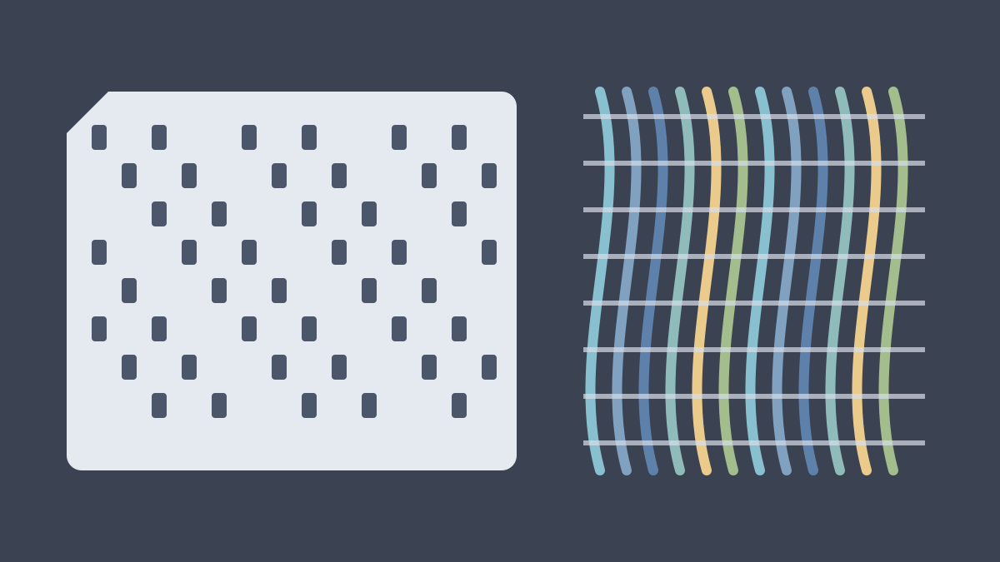

Lorem ipsum dolor sit amet, consectetur adipiscing elit. Sed do eiusmod tempor incididunt ut labore et dolore magna aliqua. Read more about the [Jacquard machine](https://en.wikipedia.org/wiki/Jacquard_machine) and the [Analytical Engine](https://en.wikipedia.org/wiki/Analytical_engine).

## Cards as instructions

Ut enim ad minim veniam, quis nostrud exercitation ullamco laboris nisi ut aliquip ex ea commodo consequat. A card does three things:

1. Lorem ipsum dolor sit amet
2. Consectetur adipiscing elit
3. Sed do eiusmod tempor incididunt

## What carries over

Duis aute irure dolor in reprehenderit in voluptate velit esse cillum dolore eu fugiat nulla pariatur.

- Lorem ipsum dolor sit amet
  - Nested: consectetur adipiscing elit
  - Nested: sed do eiusmod tempor
- Ut labore et dolore magna aliqua
- Ut enim ad minim veniam

> Lorem ipsum dolor sit amet, consectetur adipiscing elit. Nullam varius, turpis et commodo pharetra, est eros bibendum elit.
>
> Nec luctus magna felis sollicitudin mauris.

Excepteur sint occaecat cupidatat non proident, sunt in culpa qui officia deserunt mollit anim id est laborum.
